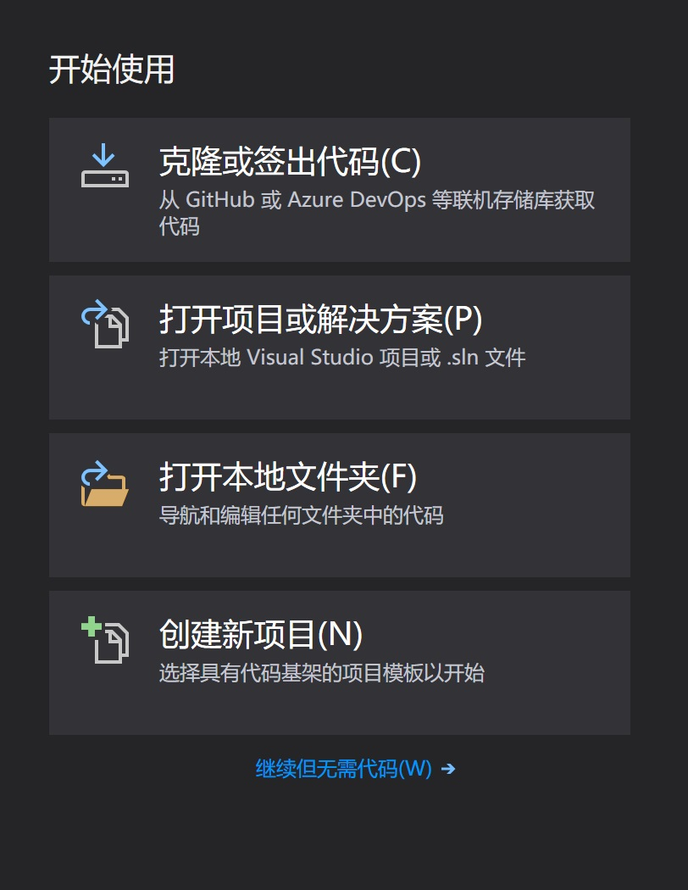

# DS2VS2019

本人学习严版数据结构时，发现部署到VS2019上很困难，本仓库致力于调整该书的文件结构，使其能直接部署于VS2019

## 依赖环境

- 操作系统:WINDOWS 10
- IDE:Visual Studio 2019
- 编译环境:C++

## _如何在VS2019中成功运行？_

### 以New_main 2-1.cpp为例

0. scanf等报错怎么办？

项目(P)->属性->C/C++->代码生成->安全检查

1.  首先打开VS2019，新建一个项目

2.  找到项目所在的地址，这里以DS2VS2019为例

\source\repos\DS2VS2019\DS2VS2019 地址下拷入特定项目的文件，

3.  将需要运行的cpp文件，拖入源文件中

_拖且仅拖需要运行的cpp文件,头文件随意_

4. Press F5，运行

